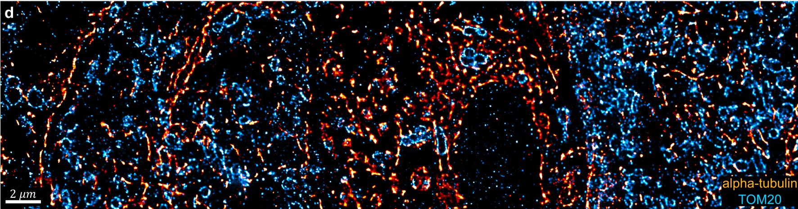

# One-Click Image Reconstruction in Single-Molecule Localization Microscopy via Deep Learning

This repository accompanies the paper:  
**_"One-click image reconstruction in single-molecule localization microscopy via deep learning"_**

> 📄 Please make sure to [cite the original paper](#citation) when using or extending this work.

---

## Repository Structure

This project is divided into two main components:

- **AutoDS** — AutoDS inference and 2D Deep-STORM model training
- **AutoDS3D** — GUI-based AutoDS3D localization pipeline

---

## AutoDS

This part contains two Jupyter notebooks:
- **Training**: Train your own Deep-STORM model
- **Inference**: Run AutoDS for one-click image reconstruction

> Pre-trained models (4 total) are available in the `models/` directory.

---

## AutoDS3D: Step-by-Step GUI Instructions

To run the 3D GUI tool:

1. **Set target machine**  
   In `app.py`, specify whether you're running locally or on a remote server by commenting/uncommenting the appropriate line and setting the IP address.

2. **Set up Python environment**  
   Use a virtual environment with the required packages (see `requirements.txt` if provided).

3. **Run the app**  
   Execute `app.py` (e.g., via terminal or PyCharm) and open the generated URL in your browser.

4. **Fill in parameters**  
   Default values are provided and can be safely used — you can fine-tune them during later steps.

5. **Characterize PSF**  
   After clicking, check:
   - `phase_retrieval_results.jpg` for model accuracy
   - `PSFs.jpg` to verify Z-range and NFP  
   Adjust pixel size and re-run if necessary.

6. **Preprocess blinking images**  
   A confirmation notification will be shown after completion.

7. **Characterize SNR**  
   After clicking:
   - Note the detected MPV (Maximum Pixel Value)
   - For stronger simulated signals, manually set a higher MPV
   - Setting MPV to 0 uses the detected value

8. **Generate training data**  
   Validate the generated training data and adjust MPV as needed.

9. **Train localization network**  
   Launch the training process directly from the GUI.

10. **Run localization test**  
    - Set test image index and threshold (0–800)
    - Check output files:
      - `sim_loc_gt_rec.jpg`
      - `sim_im_gt_rec.jpg`
      - `exp_im_gt_rec.jpg`

11. **Run final localization**  
    Generates a complete localization table of your input data.

---

## Citation

If you use this work, please cite:  
**[One-click image reconstruction in single-molecule localization microscopy via deep learning (bioRxiv link)](LINK_HERE)**
