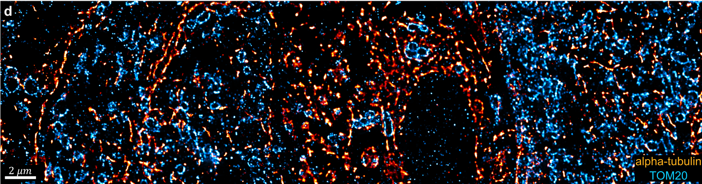

# One-Click Image Reconstruction in Single-Molecule Localization Microscopy via Deep Learning

This repository accompanies the paper:  
**_"One-click image reconstruction in single-molecule localization microscopy via deep learning"_**

> 📄 Please make sure to [cite the original paper](#citation) when using or extending this work.

---

## Repository Structure

This project is divided into two main components:

- **AutoDS** — AutoDS inference and 2D Deep-STORM model training
- **AutoDS3D** — GUI-based AutoDS3D localization pipeline

---

## AutoDS

This part contains two Jupyter notebooks:
- **Training**: Train your own Deep-STORM model
- **Inference**: Run AutoDS for one-click image reconstruction

> Pre-trained models (4 total) are available in the `models/` directory.

---

## AutoDS3D Instructions

**see the guideline in AutoDS3D**  

---

## Citation

If you use this work, please cite:  
**[One-click image reconstruction in single-molecule localization microscopy via deep learning (bioRxiv link)](LINK_HERE)**
